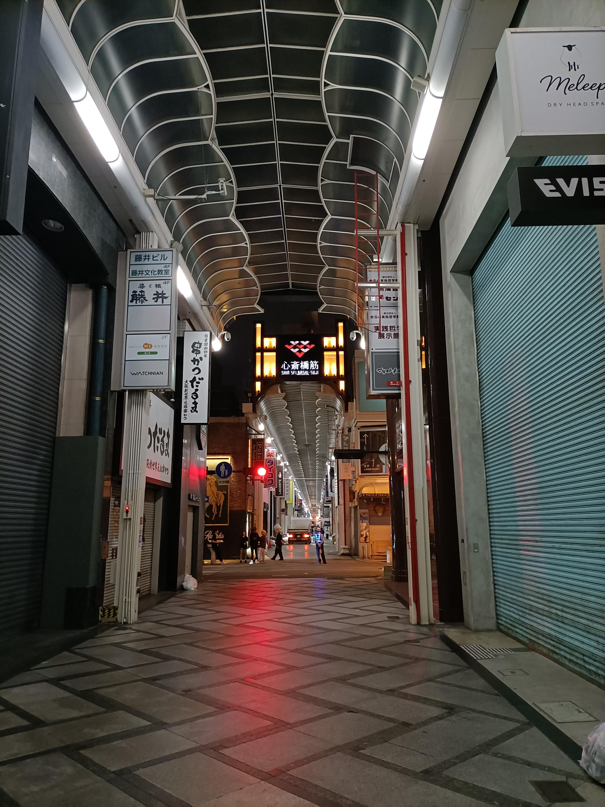
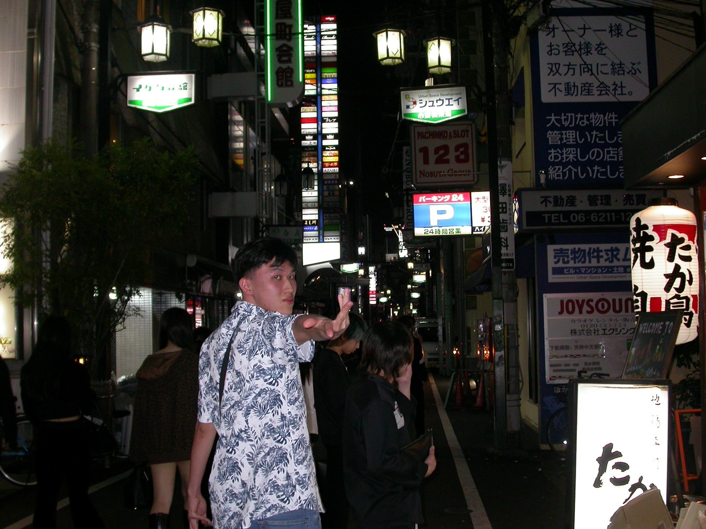
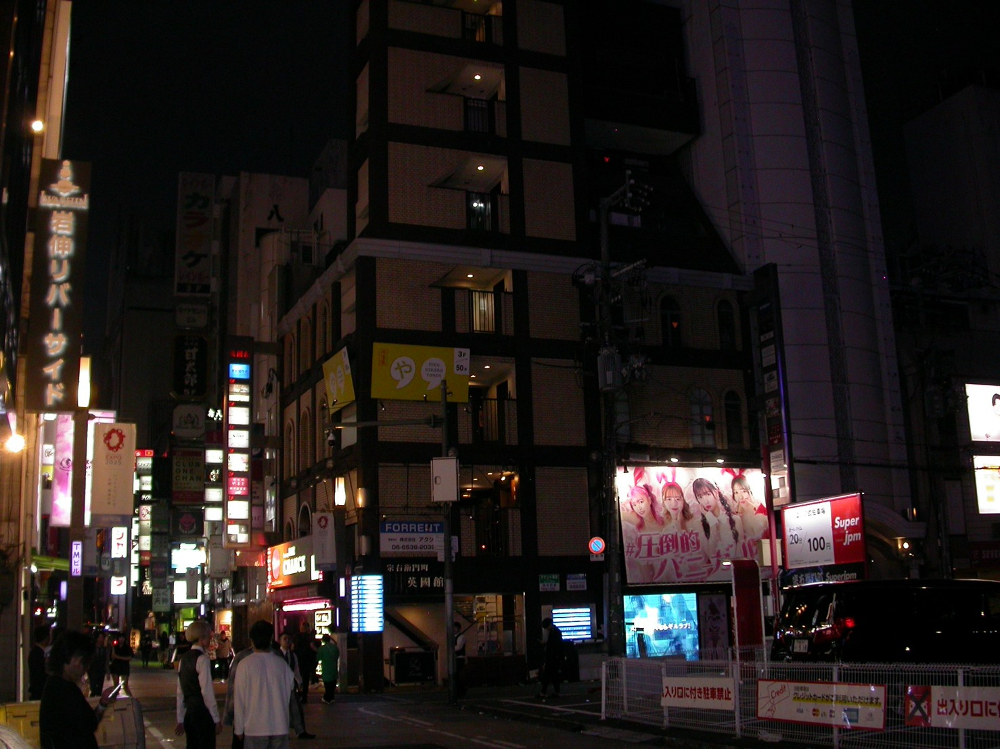
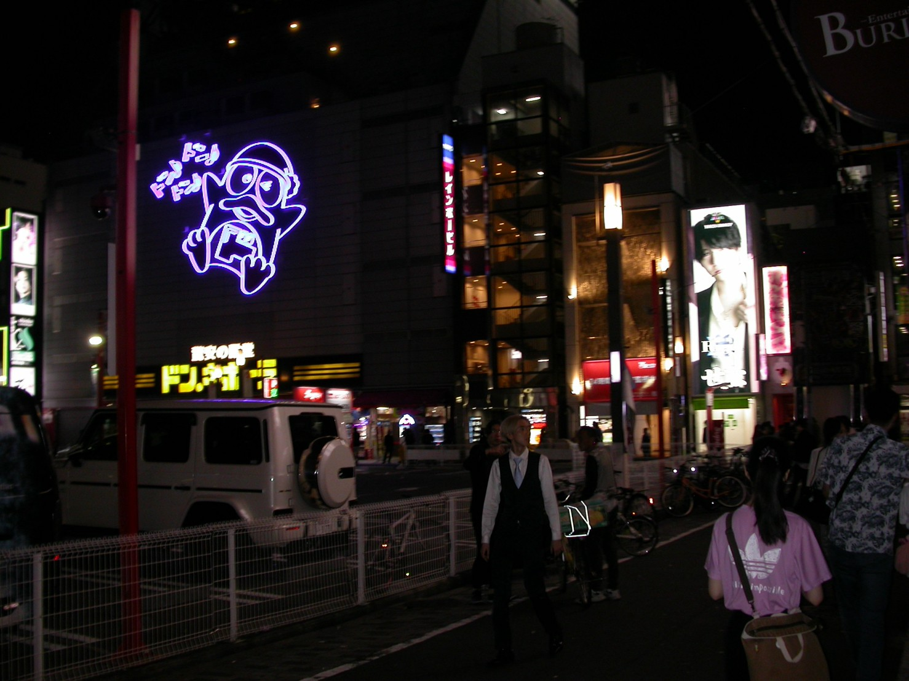
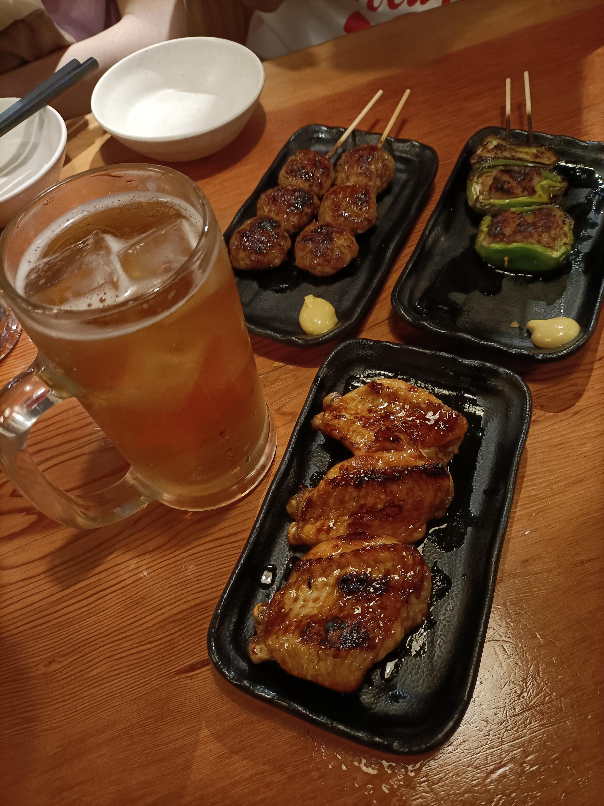
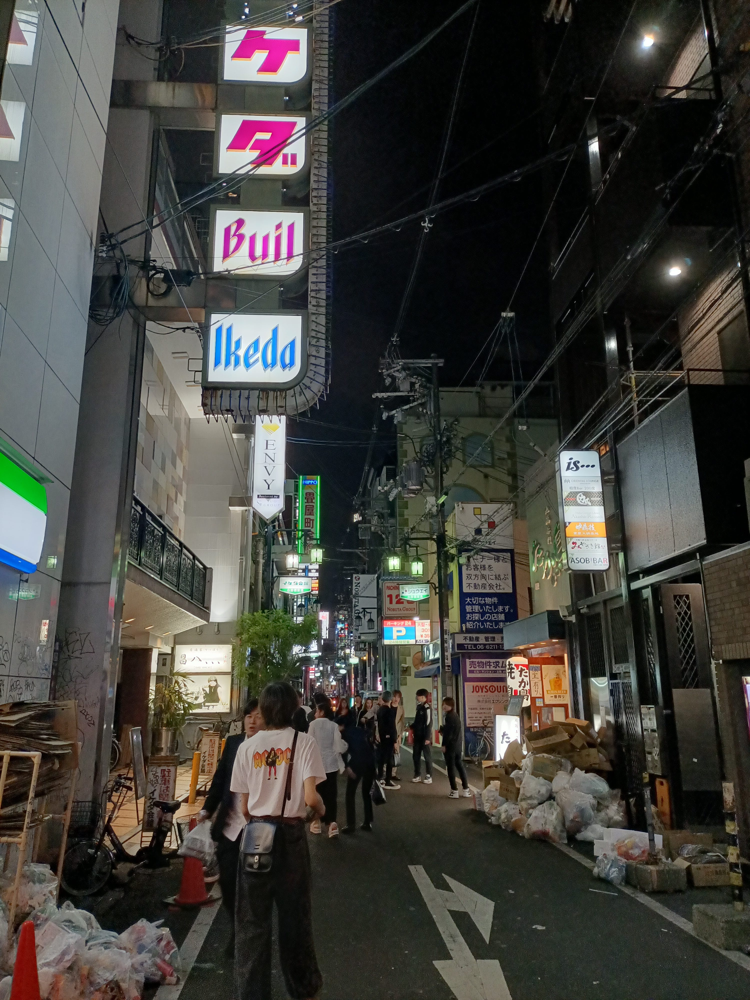
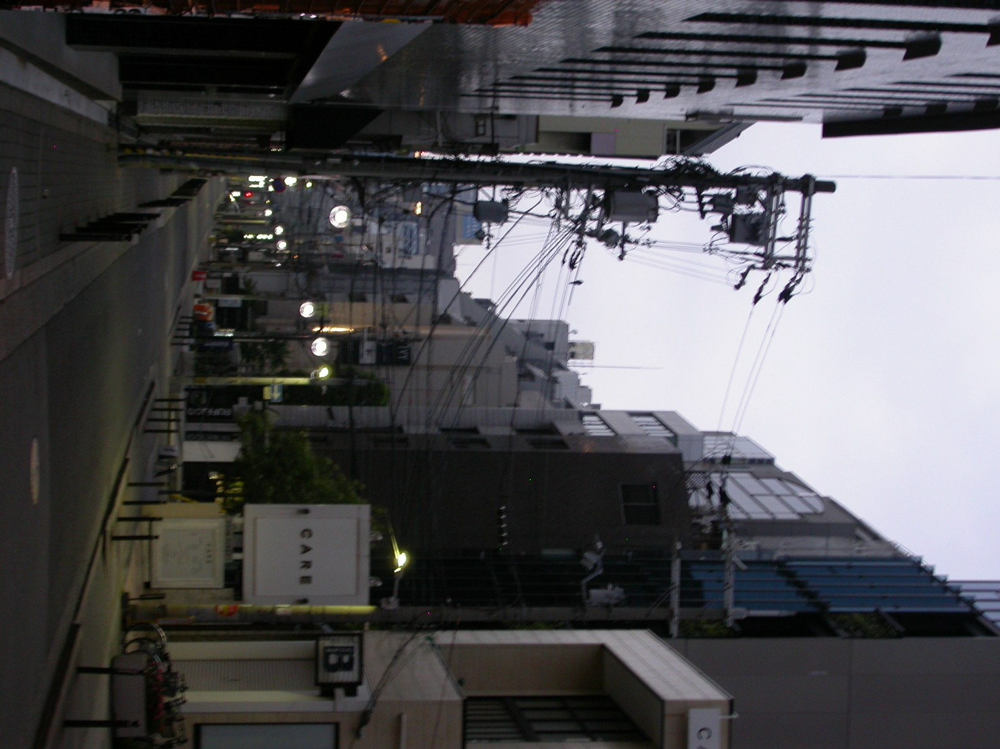

# 前情提要

有什麼好前情提要的呢？被拐出國的經過吧。

然後就給這個大 P 人朋友去規劃行程了。缺點就是行程會非常的不明確，等到我中於有時間關心行程時 (a.k.a. 五月底期末考前) 才在確認機票、住宿應該不會有問題嗎…之類的。

但總之後期末考完後的事情也沒那麼麻煩，事情弄完的週六回家，週日上午整理一下行李，下午提早搭車去機場…然後就都是後話了。

就這樣，2025/06/08 ~ 14，五天六夜的日本行。



行程中大部份照片都是用朋友帶的 Nikon 旋轉相機拍的，也是為什麼拖這麼久的一大原因。

# 心得

## Day 0：鳥貴族、唐吉軻德

第一天到關西機場就十一點多了，在機場找 ICOCA 找了半天，但直接去碰機器其實就行了。終於到達難波，也正好到了電車停駛的時間。經過醉倒的路人，走著到了旅館放行李，整頓一下再吃宵夜。

結果先看到的心斎橋是關著門的，最後去了鳥貴族和唐吉軻德。第一天就去唐吉軻德確實不太對。

> ##### 鳥貴族 心斎橋ヨーロッパ通り店
>  日本〒542-0083 Osaka, Chuo Ward, Higashishinsaibashi, 2 Chome−8−26 Fuku Bld. Shinsaibashi, 心斎橋 ４階
> ##### ドン・キホーテ 道頓堀店
>  7-13 Souemoncho, Chuo Ward, Osaka, 542-0084日本

鳥貴族就很居酒屋，人也不多。就是 ¥390 一盤烤串，連啤酒也是，但都很好吃，很有感覺。話說去的那幾天我甚至才 19 歲，以日本法規的話是不能喝酒的，所以當時點的是無酒精。

看唐吉軻德員工大部份是外籍人口，才意識到這種觀光地區與店面果然是移居日本打工的第一站，甚至連語言也能通。

結果天亮回旅館時才發現對面就有一家鳥貴族。🙂


  
  
  
  
  
  
  


## Day 1：勝尾寺、道頓堀



## Day 2：大阪環球

## Day 3：大阪城、京都拉麵

## Day 4：和服、清水寺、伏見稻荷大社

## Day 5：祇園、花見小路

# 後記