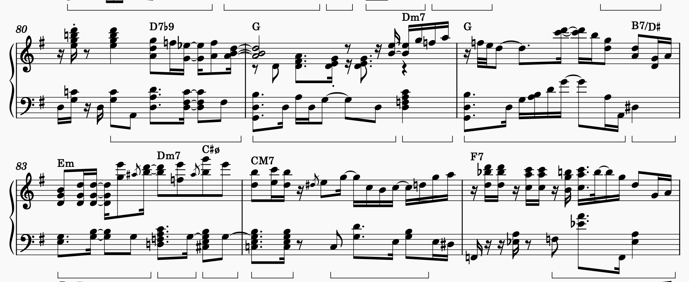



剛好社課討論提到了半減七和弦，就來多討論一下吧！

具體的「正常」用法就先召喚好和弦了：



而其中提到的「假終止」用法這邊也有講到：

https://www.reddit.com/r/musictheory/comments/15n9n9m/comment/jvkpdhr/

我這邊傾向於把其中的 `vi/V` 解釋為同上面連結，一級 64 加上 6 度音。

但我們通常會同時討論它的下個和弦，畢竟一個 `#VIø` 通常不會是個穩定的終點（並非大、小和弦）：

這邊就著重討論流行常見的和弦進行，通常會是 `#IVø-IV`（想像 `#Fm7b5-F` 或 `FM7`），可以解釋成「沒那麼緊張的，通往四級的增六（雖然內部組成音不同）」，且若替換成 `#FM7` 的話，兩者之間只有 \(^\#4-4\) 的不同，在前面配上 `V (G)` 的話就會形成 \(5-^\#4-4$\) 的下行解決。欸？Bass 的半音下行就出來了！也很常見的 `Am-Am/G-#Fm7b5 (-FM7)`，上三音 A、C、E 不動，下三音又是半音下行，因此聽感也很流暢。

而半音下行這件事還能繼續延伸，像是 `#IV-IV-iii-biii-ii-V-I`，回到一級的和弦進行，如同這篇所討論到的：

https://greghowlett.com/blog/free-lessons/how-to-use-the-half-diminished-chord.aspx

並且最後的 `V` 也能替換成增六（如 `It+6`，\(^b2-4-7\)），變成完全的半音下行解決…扯得有點遠了。

## 使用例


 就是為了這點醋包的餃子！
 

### Walking by the Sea





可以看到 \(83\)~\(84\) 小節出現了 G 大調的 `v7-#IVø-IVM7`，小差別在於他用的是借用的 `v7` 而非 `V7`，多一點小調的色彩。

### 驛站

<audio controls preload="auto">
    <source src="14.mp3">
</audio>


在第 \(44\) 小節出現了 E 大調上的 `vi-vi/V-#VIø`！但它解決到的是同為下屬和弦的 `ii7` 而非 `IV`，依舊能解釋成通往四級的增六？值得注意的是，在第 \(42\) 與第 \(46\) 小節同樣也出現了 `D#ø` 與 `G#ø` 兩個半減七，但它們都是各自作為 `C#m` 與 `F#m7` 的小調二級去解決，也就是正常的用法。
    
## \#IVø-IV 的延後五級套路

直接看例子：



是常見的 4536 耶…又好像不太一樣？

```
bar 9    | 10   | 11   | 12
----------------------------------------
    CbM7 - Db   - Bbm7 - Ebm  - (Gb/Db) 
Gb: IV   - V    - iii  - vi   - (I64)

bar 13   | 14   | 15   | 16   | 17 
----------------------------------------
    Cø   - CbM7 - Db   - Eb   - Ab7
Gb: #IVø - IV   - V
Eb:        bVI  - bVII - I    - IV
```

第二次的 4536 前面被塞了升四的半減七！同樣的 `vi-I64-#IVø-IV` 除了修飾第二次的 `IV`，也「延後」了 `IV-V` 的到來。為什麼說延後呢？

回顧 4536 這個和弦進行，是從 `IV-V-vi`（下屬-屬-主）的假終止而來，同時引入 `iii` 來修飾 `vi` 以免兩小節的 `vi` 太無聊。但如果今天想在下個樂句回到 `I` 迎來正格終止怎麼辦？直接接一級好像又太早？這個時候 `#IVø` 的作用就出來了：它讓第二個樂句沒那麼地相似，同時把 `V`「推」到了第三個小節，讓它可以名正言順地延長至第四個小節，然後終止，如 `#IVø-IV-Vsus-V-I`。

當然直接回家就太無聊了，<strike>流行歌就是要停在四級啊！</strike>像這首的前奏就來了個正負三轉調！類似的還出現在導歌進副歌：

```
    Aø   - AbM7 - Fm7  - Gm7 - AbM7 -  G7     - CbM7
Eb: #IVø - IV   - ii   - iii - IV   -  III
Gb:                                   (Ger+6 - I) of IV
```

又或者是像間奏（\(3:00\)）後面不動的 `#IVø-IV-iii-VI`…有點太多了。
